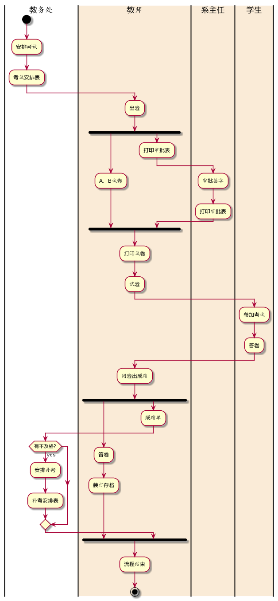
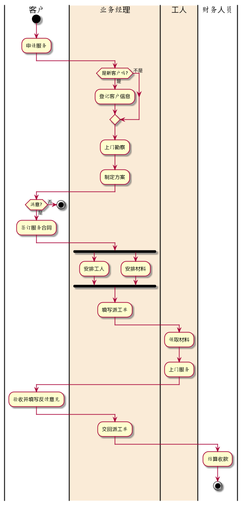

# 实验1：业务流程建模 [返回](../README.md)

| 学号           | 班级        | 姓名   | 照片                          |
| ------------ | --------- | ---- | --------------------------- |
| 201510414211 | 软件（本）15-2 | 罗家杰  |  |

## 流程图1：考试及成绩管理流程

### Plantuml源码如下：

```
@startuml
|教务处|
start
:安排考试;
:考试安排表;
|#AntiqueWhite|教师|
:出卷;
fork
   :A、B试卷;
fork again
   :打印审批表;
|#AntiqueWhite|系主任|
:审批签字;
:打印审批表;
|教师|
endfork
:打印试卷;
:试卷;
|#AntiqueWhite|学生|
:参加考试;
:答卷;
|教师|
:阅卷出成绩;
fork
   :答卷;
   :装订存档;
fork again
   :成绩单;
|教务处|
if(有不及格?) then (yes)
:安排补考;
:补考安排表;
endif
|教师|
endfork
:流程结束;
stop
@enduml
```

### 业务流程图如下：

### 

### 流程说明：

在区分各功能的使用者的时候，通常使用的是 “|功能使用者|” 和 “|#AntiqueWhite|功能使用者|” 代码实现。其他则是使用非常简单的代码就可以实现。


## 流程图2：客户维修服务流程

### plantuml源码如下：

```
@startuml
|客户|
start
:申请服务;
|#AntiqueWhite|业务经理|
if(是新客户吗?) then (是)
  :登记客户信息;
else (不是)
endif
:上门勘察;
:制定方案;
|客户|
if(满意?) then (否)
stop
else(是)
:签订服务合同;
|业务经理|
fork
   :安排工人;
fork again
   :安排材料;
end fork
:填写派工单;
|#AntiqueWhite|工人|
:领取材料;
:上门服务;
|客户|
:验收并填写反馈意见;
|业务经理|
:交回派工单;
|财务人员|
:结算收款;
stop
@enduml
```

### 业务流程图如下：



### 流程说明：

在“安排工人”和“安排材料”模块，则是使用的 “fork”和“fork again”代码实现的，其他则是使用非常简单的代码就可以实现。