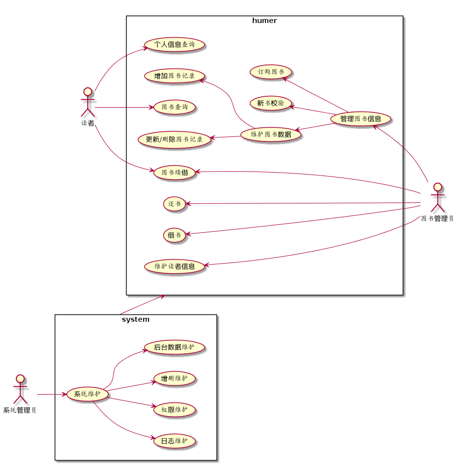
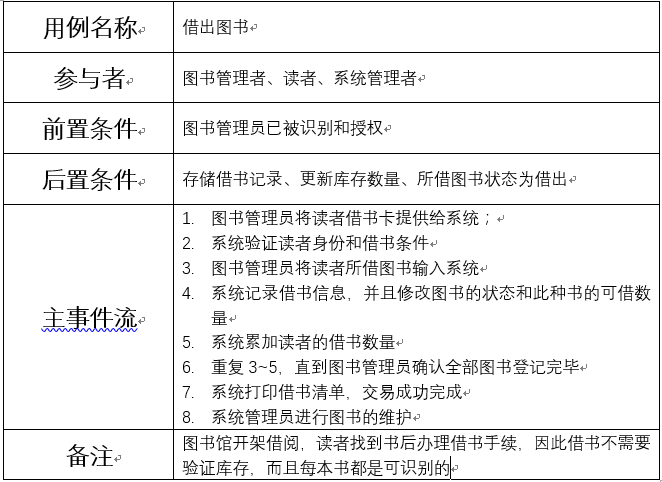
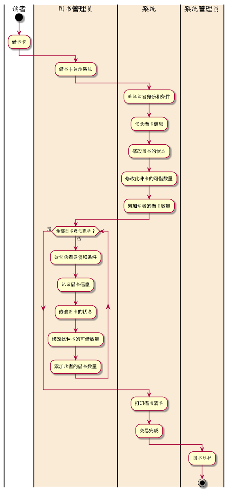
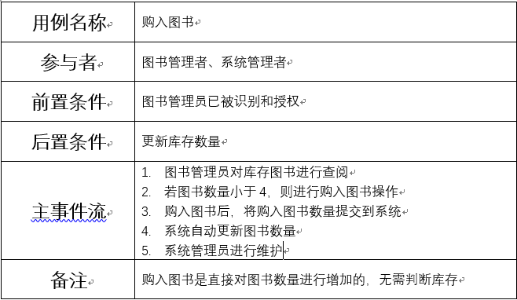
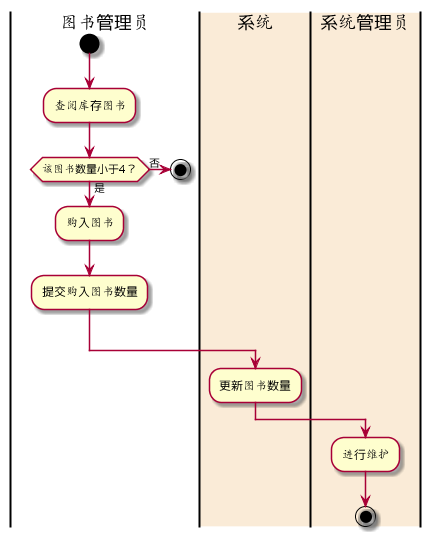
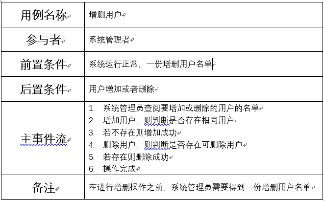
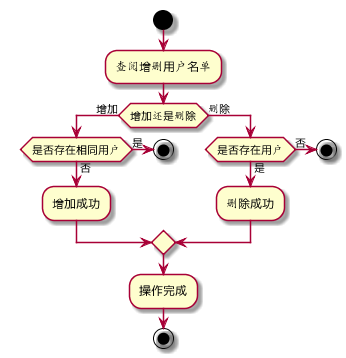

# 实验2：图书管理系统用例建模[返回](../README.md)

## 1.图书管理系统的用例关系图

### 1.1用例图PlantUML源码如下：

```
@startuml
left to right direction
skinparam packageStyle rectangle
actor 读者
actor 图书管理员
actor 系统管理员
rectangle humer {
读者 --> (图书查询)
读者 --> (个人信息查询)
读者 --> (图书续借)
(图书续借) <-- 图书管理员
(还书) <-- 图书管理员
(借书) <-- 图书管理员
(维护读者信息) <-- 图书管理员
(管理图书信息) <-- 图书管理员
(订购图书) <-- (管理图书信息)
(新书校验) <-- (管理图书信息)
(维护图书数据) <-- (管理图书信息)
(增加图书记录) <-- (维护图书数据)
(更新/删除图书记录) <-- (维护图书数据)
}
rectangle system{
系统管理员 --> (系统维护)
(系统维护) --> (日志维护)
(系统维护) --> (权限维护)
(系统维护) --> (增删维护)
(系统维护) --> (后台数据维护)
}

system --> humer
@enduml
```

### 1.2用例图如下：



## 2.参与者说明：

### 2.1图书管理员

主要职责是：借书还书管理，读者和图书信息维护

### 2.2读者

主要职责是：借书，还书

### 2.3系统管理员：

主要职责是：系统维护


## 3.用例规约表

### 3.1“借出图书”用例



#### "借出图书"用例流程图源码如下：

```
@startuml
|读者|
start
:借书卡;
|#AntiqueWhite|图书管理员|
:借书卡转给系统;
|#AntiqueWhite|系统|
:验证读者身份和条件;
:记录借书信息;
:修改图书的状态;
:修改此种书的可借数量;
:累加读者的借书数量;
|图书管理员|
while (全部图书登记完毕 ?) is (否)
:验证读者身份和条件;
:记录借书信息;
:修改图书的状态;
:修改此种书的可借数量;
:累加读者的借书数量;
endwhile (是)
|系统|
:打印借书清单;
:交易完成;
|#AntiqueWhite|系统管理员|
:图书维护;
stop
@enduml
```

#### "借出图书"用例流程图如下：



### **3.2“购入图书”用例**



#### "购入图书"用例流程图源码如下：

```
@startuml
|图书管理员|
start
:查阅库存图书;
if (该图书数量小于4？) then (是)
:购入图书;
:提交购入图书数量;
else (否)
stop
endif
|#AntiqueWhite|系统|
:更新图书数量;
|#AntiqueWhite|系统管理员|
:进行维护;
stop
@enduml
```

#### "购入图书"用例流程图如下：



### **3.3“增删用户”用例**



#### "增删用户"用例流程图源码如下：

```
@startuml
|系统管理者|
start
:查阅增删用户名单;
if (增加还是删除) then (增加)
  if(是否存在相同用户) then (否)
  :增加成功;
  else (是)
  stop
  endif

else (删除) 
  if(是否存在用户) then (是)
  :删除成功;
  else (否)
  stop
  endif
endif
:操作完成;
stop
@enduml
```

#### "增删用户"用例流程图如下：



#### 