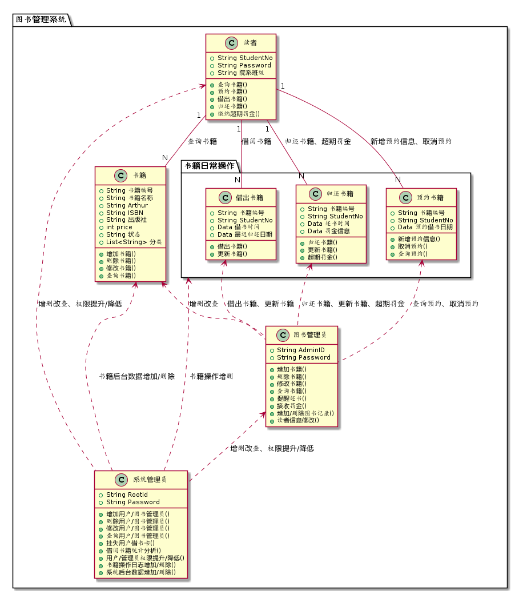
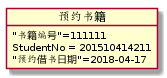
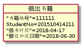
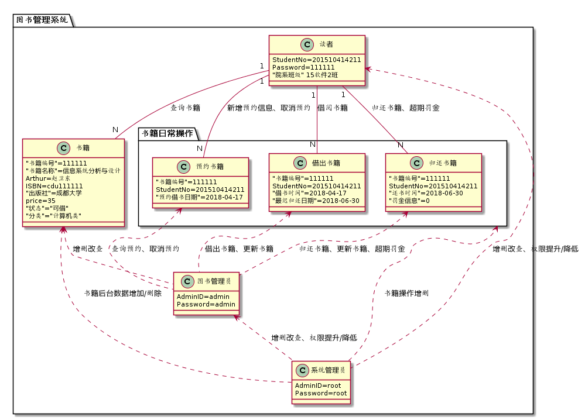

# 实验3：图书管理系统领域对象建模[返回](../README.md)

## 1.图书管理系统类图

### 1.1 PlantUML源码如下:

```
@startuml
package "图书管理系统"{
class 读者 {
   +String StudentNo
   +String Password
   +String 院系班级

   +查询书籍()
   +预约书籍()
   +借出书籍()
   +归还书籍()
   +缴纳超期罚金()
}
package "书籍日常操作"{
class 预约书籍 {
  +String 书籍编号
  +String StudentNo
  +Data 预约借书日期

  +新增预约信息()
  +取消预约()
  +查询预约()
}
class 借出书籍 {
  +String 书籍编号
  +String StudentNo
  +Data 借书时间
  +Data 最迟归还日期
  +借出书籍()
  +更新书籍()
}
class 归还书籍 {
  +String 书籍编号
  +String StudentNo
  +Data 还书时间
  +Data 罚金信息
  +归还书籍()
  +更新书籍()
  +超期罚金()
}
}
class 书籍 {
   +String 书籍编号
   +String 书籍名称
   +String Arthur
   +String ISBN
   +String 出版社
   +int price
   +String 状态
   +List<String> 分类

   +增加书籍()
   +删除书籍()
   +修改书籍()
   +查询书籍()
}
class 图书管理员{
     +String AdminID
     +String Password

     +增加书籍()
     +删除书籍()
     +修改书籍()
     +查询书籍()
     +提醒还书()
     +接收罚金()
     +增加/删除图书记录()
     +读者信息修改()
}
class 系统管理员 {
   +String RootId
   +String Password

   +增加用户/图书管理员()
   +删除用户/图书管理员()
   +修改用户/图书管理员()
   +查询用户/图书管理员()
   +挂失用户借书卡()
   +借阅书籍统计分析()
   +用户/管理员权限提升/降低()
   +书籍操作日志增加/删除()
   +系统后台数据增加/删除()
}

读者"1" -- "N"书籍:查询书籍
读者"1" -- "N"预约书籍:新增预约信息、取消预约
读者"1" -- "N"借出书籍:借阅书籍
读者"1" -- "N"归还书籍:归还书籍、超期罚金

书籍 <.. 图书管理员:增删改查
借出书籍 <.. 图书管理员:借出书籍、更新书籍
归还书籍 <.. 图书管理员:归还书籍、更新书籍、超期罚金
预约书籍 <.. 图书管理员:查询预约、取消预约
读者 <.. 系统管理员:增删改查、权限提升/降低
图书管理员 <.. 系统管理员:增删改查、权限提升/降低
书籍 <.. 系统管理员:书籍后台数据增加/删除
书籍日常操作 <.. 系统管理员:书籍操作增删

}
@enduml
```

### 1.2 类图:



## 2.图书管理系统对象图

### 2.1预约书籍

#### 1.PlantUML源码

```
@startuml
object 预约书籍{
    "书籍编号"=111111
    StudentNo = 201510414211
    "预约借书日期"=2018-04-17
}
@enduml
```

#### 2.预约对象图



### 2.2 借出图书

#### 1.PlantUML源码

```
@startuml
object 借出书籍{
    "书籍编号"=111111
    StudentNo=201510414211
    "借书时间"=2018-04-17
    "最迟归还日期"=2018-06-30
}
@enduml
```

#### 2.借出对象图



### 2.3图书管理系统

#### 1.PlantUML源码

```
@startuml
package "图书管理系统"{
class 读者 {
   StudentNo=201510414211
   Password=111111
   "院系班级" 15软件2班
}
package "书籍日常操作"{
class 预约书籍 {
  "书籍编号"=111111
  StudentNo=201510414211
  "预约借书日期"=2018-04-17
}
class 借出书籍 {
  "书籍编号"=111111
   StudentNo=201510414211
   "借书时间"=2018-04-17
   "最迟归还日期"=2018-06-30
}
class 归还书籍 {
  "书籍编号"=111111
   StudentNo=201510414211
   "还书时间"=2018-06-30
   "罚金信息"=0
}
}
class 书籍 {
   "书籍编号"=111111
    "书籍名称"=信息系统分析与设计
    Arthur=赵卫东
    ISBN=cdu111111
    "出版社"=成都大学
    price=35
    "状态"="可借"
    "分类"="计算机类"
}
class 图书管理员{
     AdminID=admin
     Password=admin
}
class 系统管理员 {
     AdminID=root
     Password=root
}

读者"1" -- "N"书籍:查询书籍
读者"1" -- "N"预约书籍:新增预约信息、取消预约
读者"1" -- "N"借出书籍:借阅书籍
读者"1" -- "N"归还书籍:归还书籍、超期罚金

书籍 <.. 图书管理员:增删改查
借出书籍 <.. 图书管理员:借出书籍、更新书籍
归还书籍 <.. 图书管理员:归还书籍、更新书籍、超期罚金
预约书籍 <.. 图书管理员:查询预约、取消预约
读者 <.. 系统管理员:增删改查、权限提升/降低
图书管理员 <.. 系统管理员:增删改查、权限提升/降低
书籍 <.. 系统管理员:书籍后台数据增加/删除
书籍日常操作 <.. 系统管理员:书籍操作增删

}
@enduml
```

#### 2.图书管理系统对象图



