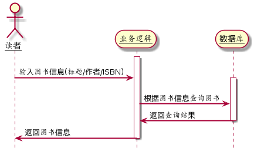

# 实验4 图书管理系统顺序图[返回](../README.md)

## 1.系统管理员

### 1.1 管理图书管理员/读者

#### 1.1.1 源码

```
@startuml
skinparam sequenceArrowThickness 3
skinparam roundcorner 30
skinparam maxmessagesize 80
skinparam sequenceParticipant underline
hide footbox

actor 系统管理员 as root
actor 图书管理员 as admin
actor 读者 as user

activate root
root -> admin:管理图书管理员账户
root -> user:管理读者账号
deactivate root

activate admin
admin -> admin:校验账户信息
admin -> root:反馈账户信息
deactivate admin

activate user
user -> user:校验账户信息
user -> root:反馈账户信息
deactivate user
@enduml
```

#### 1.1.2 顺序图


#### 说明

顺序图过程展现了系统管理员对图书管理员和读者的管理和维护，同时图书管理员和读者都可以反馈信息给系统管理员。


## 2. 图书管理员

### 2.1 添加图书

#### 2.1.1 源码

```
@startuml
skinparam sequenceArrowThickness 2
skinparam roundcorner 30
skinparam maxmessagesize 80
skinparam sequenceParticipant underline
hide footbox

图书管理员 -> 业务逻辑 : 输入新增图书信息
			业务逻辑 -> 数据库 : 查询新增ISBN
			数据库 -> 业务逻辑 : 返回ISBN信息
			业务逻辑 -> 业务逻辑 : ISBN信息为空
			业务逻辑 -> 数据库 : 新增图书
			业务逻辑 -> 数据库 : 更新图书库存
			数据库 -> 业务逻辑 : 返回操作结果
		deactivate 数据库
	业务逻辑 -> 图书管理员 : 返回添加结果
	deactivate 业务逻辑
@enduml
```

#### 2.1.2 顺序图


#### 2.1.4 说明

该图说明了添加图书的过程


### 2.2 查询图书

#### 2.2.1 源码

```
@startuml
skinparam sequenceArrowThickness 2
skinparam roundcorner 30
skinparam maxmessagesize 80
skinparam sequenceParticipant underline
hide footbox

actor 读者

activate 业务逻辑
	读者 -> 业务逻辑 :  输入图书信息(标题/作者/ISBN)
		activate 数据库
			业务逻辑 -> 数据库 : 根据图书信息查询图书
			数据库 -> 业务逻辑 : 返回查询结果
		deactivate 数据库
			业务逻辑 -> 读者 : 返回图书信息
deactivate 业务逻辑
@enduml
```

#### 2.2.2 顺序图



#### 2.2.3 说明

该图说明了图书管理员在查询图书方面的过程


### 2.3 借出图书

#### 2.3.1 源码

```
@startuml
skinparam sequenceArrowThickness 2
skinparam roundcorner 20
skinparam maxmessagesize 60
skinparam sequenceParticipant underline
hide footbox

actor 图书管理员

autonumber
group 读者账号权限
activate 账号判断
	图书管理员 -> 账号判断 :  输入读者账号
	activate 业务逻辑
		账号判断 -> 业务逻辑 : 获取账号信息
deactivate 账号判断
		activate 数据库
			业务逻辑 -> 数据库 : 查询账户的借阅权限
			数据库 --> 业务逻辑 : 账号合法(是/否)
end
group 借出图书
			图书管理员 -> 业务逻辑 : 输入借出图书码
			业务逻辑 -> 数据库 : 查询预约信息
			数据库 -> 业务逻辑 : 未被预约
			业务逻辑 -> 数据库 : 新增借阅信息
			业务逻辑 -> 数据库 : 修改图书库存
			数据库 -> 业务逻辑 : 返回操作结果
		deactivate 数据库
	业务逻辑 -> 图书管理员 : 返回借出结果
	deactivate 业务逻辑
end
@enduml
```

#### 2.3.2 顺序图


#### 2.3.3 说明

该图说明了借出图书的过程，过程中包括图书管理员和读者两位角色。


### 2.4 归还图书

#### 2.4.1 源码

```
@startuml
skinparam sequenceArrowThickness 2
skinparam roundcorner 20
skinparam maxmessagesize 60
skinparam sequenceParticipant underline
hide footbox

actor 图书管理员


autonumber
group 读者账号权限
activate 账号判断
	图书管理员 -> 账号判断 :  输入读者账号
	activate 业务逻辑
		账号判断 -> 业务逻辑 : 获取账号信息
deactivate 账号判断
		activate 数据库
			业务逻辑 -> 数据库 : 查询借阅信息
			数据库 --> 业务逻辑 : 返回借阅信息
end
group 归还图书
			图书管理员 -> 业务逻辑 : 输入归还图书码
			业务逻辑 -> 数据库 : 查询超期信息
			数据库 -> 业务逻辑 : 返回超期信息
			业务逻辑 -> 业务逻辑 : 若超期支付罚金
			业务逻辑 -> 数据库 : 更新借阅信息
			业务逻辑 -> 数据库 : 更新图书库存
			数据库 -> 业务逻辑 : 返回操作结果
		deactivate 数据库
	业务逻辑 -> 图书管理员 : 返回还书结果
	deactivate 业务逻辑


end
@enduml
```

#### 2.4.2 顺序图


#### 2.4.3 说明

该图说明了归还图书的过程，其中包括了图书管理员和读者两位角色，罚金部分在上一节中已经提到。


