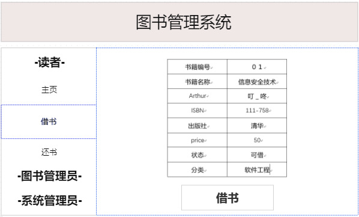

# 实验5 图书管理系统数据库设计与界面设计[返回](../README.md)

## 1.数据库表设计

### 1.1书籍

|   字段   |      类型      | 主键、外键 | null？ |
| :----: | :----------: | :---: | :---: |
|  书籍编号  | varchar(100) |  主键   |  no   |
|  书籍名称  | varchar(100) |  no   |  no   |
| Arthur | varchar(100) |  no   |  no   |
|  ISBN  | varchar(100) |  no   |  no   |
|  出版社   | varchar(100) |  no   |  no   |
| price  |   int(10)    |  no   |  no   |
|   状态   | varchar(100) |  no   |  no   |
|   分类   | varchar(100) |  no   |  no   |

### 1.2读者

|    字段     |      类型      | 主键、外键 | null？ |
| :-------: | :----------: | :---: | :---: |
| StudentNo | varchar(100) |  主键   |  no   |
| Password  | varchar(100) |  no   |  no   |
|   院系班级    | varchar(100) |  no   |  no   |

### 1.3预约书籍

|    字段     |      类型      | 主键、外键 | null？ |
| :-------: | :----------: | :---: | :---: |
|   书籍编号    | varchar(100) |  主键   |  no   |
| StudentNo | varchar(100) |  no   |  no   |
|  预约借书日期   | varchar(100) |  no   |  no   |

### 1.4借出书籍

|    字段     |      类型      | 主键、外键 | null？ |
| :-------: | :----------: | :---: | :---: |
|   书籍编号    | varchar(100) |  主键   |  no   |
| StudentNo | varchar(100) |  no   |  no   |
|   借书时间    | varchar(100) |  no   |  no   |
|  最迟归还日期   | varchar(100) |  no   |  no   |

### 1.5归还书籍

|    字段     |      类型      | 主键、外键 | null？ |
| :-------: | :----------: | :---: | :---: |
|   书籍编号    | varchar(100) |  主键   |  no   |
| StudentNo | varchar(100) |  no   |  no   |
|   还书时间    | varchar(100) |  no   |  no   |
|   罚金信息    |   int(10)    |  no   |  no   |

### 1.6图书管理员

|    字段    |      类型      | 主键、外键 | null？ |
| :------: | :----------: | :---: | :---: |
| AdminID  | varchar(100) |  主键   |  no   |
| Password | varchar(100) |  no   |  no   |

### 1.7系统管理员

|    字段    |      类型      | 主键、外键 | null？ |
| :------: | :----------: | :---: | :---: |
|  RootId  | varchar(100) |  主键   |  no   |
| Password | varchar(100) |  no   |  no   |


## 2 界面设计

### 2.1 借书界面设计



用例图参见：借书用例

类图参见：书籍、借出图书

顺序图参见：借书顺序图


## API接口如下：

### 1.查询图书API

功能：用于获取图书所有信息

请求地址： http://localhost:8080/bookmanager/api/selectBook

请求方法：POST

请求参数：

|  参数名称  |  必填  |  说明  |
| :----: | :--: | :--: |
|   书名   |  是   |  主键  |
| method |  是   | post |

返回实例：

```
{
    "info": "查询成功,返回信息",
    "data": {
        "bookNumber": "01",
        "bookName": "信息安全技术",
        "author": "叮_咚",
        "press": "清华",
        "publishDate": "2017-02-15",
        "ISBN": "111-758",
        "price": "50",
        "state": "可借",
        "Classification": "软件工程",
        },
    "code": 200
}
```

返回参数说明：

| 参数名称 |   说明   |
| :--: | :----: |
| info |  返回信息  |
| data | 返回图书信息 |
| dodo |  返回码   |


### 2.借出图书API

功能：用于获取图书所有信息

请求地址： http://localhost:8080/bookmanager/api/lendBook

请求方法：POST

请求参数：

|  参数名称  |  必填  |  说明  |
| :----: | :--: | :--: |
|  读者id  |  是   |  主键  |
| method |  是   | post |

返回实例：

```
{
    "info": "借阅成功",
    "data": {
        "result": "借阅成功",
        },
    "code": 200
}
```

返回参数说明：

| 参数名称 |   说明    |
| :--: | :-----: |
| info |  返回信息   |
| data | 返回的结果信息 |
| dodo |   返回码   |

