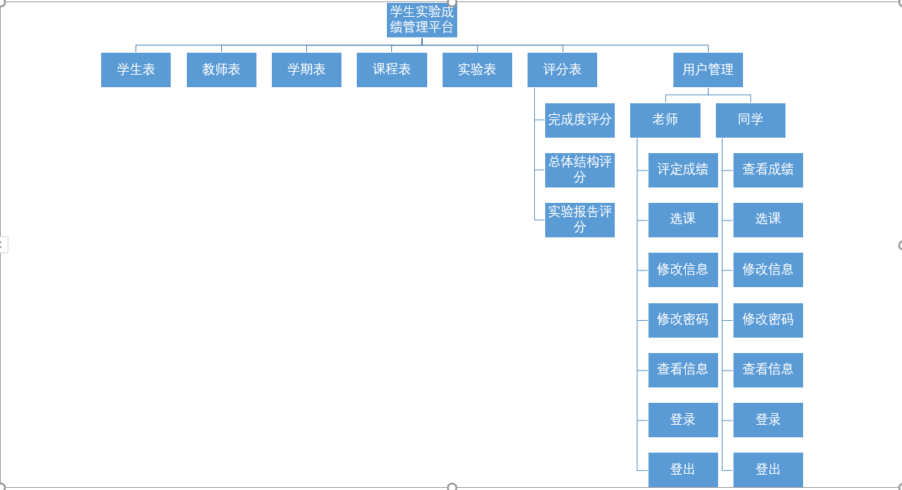
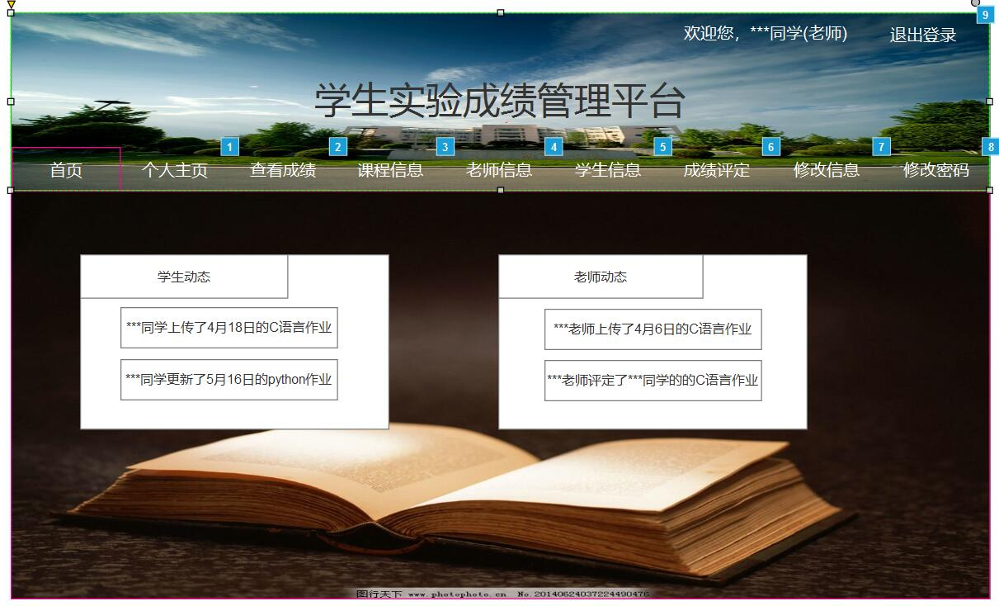
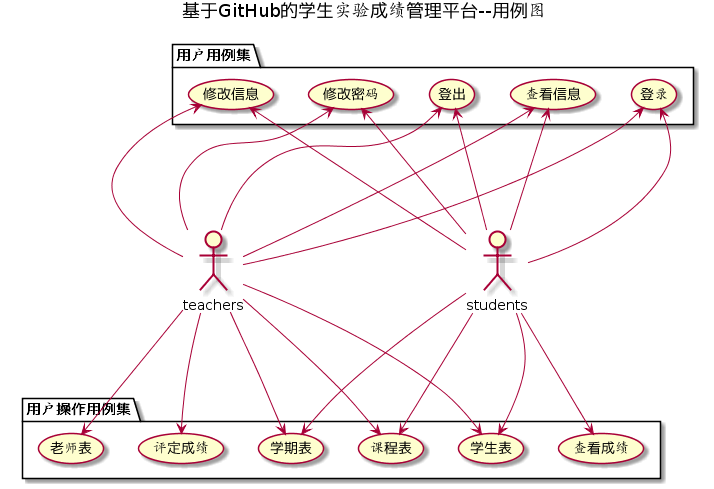
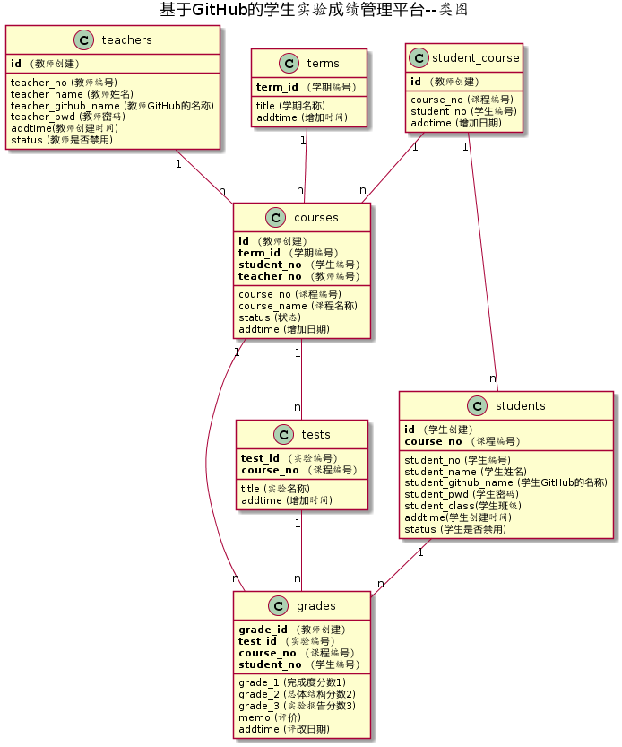

# 实验六:学生实验成绩管理平台 [返回](../README.md)

## 1.总体框架图

## 2.界面设计

界面参照:[https://luojiajie.github.io/is_analysis/test6/ui/主界面设计/index.html](https://luojiajie.github.io/is_analysis/test6/ui/主界面设计/index.html)

## 3.用例图设计 [源码](./src/管理平台用例图.puml)

## 4.类图设计 [源码](./src/管理平台类图.puml)

## 5.数据库设计

### [数据库设计](./数据库设计.md)

## 6.用例及界面详细设计

1. ### [学生表用例](./用例/学生表用例.md)

2. ### [老师表用例](./用例/老师表用例.md)

3. ### [登录用例](./用例/登录用例.md)

4. ### [登出用例](./用例/登出用例.md)

5. ### [学期表用例](./用例/学期表用例.md)

6. ### [课程表用例](./用例/课程表用例.md)

7. ### [查看用户(老师和学生)信息用例](./用例/查看用户信息用例.md)

8. ### [查看成绩用例](./用例/查看成绩用例.md)

9. ### [修改用户(老师和学生)信息用例](./用例/修改用户信息用例.md)

10. ### [评定成绩用例](./用例/评定成绩用例.md)

11. ### [修改密码用例](./用例/修改密码用例.md)

