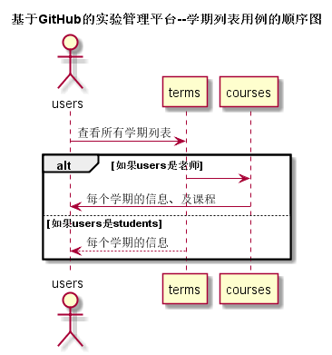

## 学期表-用例 [返回](../README.md)

### 1. 用例规约

用例名称 | 学期列表
---|---
功能 | 以表形式的显示出所有学期的信息
参与者 | 游客、学生，老师 
前置条件 | 学生和老师需要先登录，并且登录成功 
后置条件 | 显示学期表 
主事件流 | 
备选事件流 | 

### 2. 业务流程（顺序图）

### 3. 界面设计
- API接口调用
    - 接口1：[getTerms](../接口/getTerms.md)

### 4. 算法描述
无

### 5. 参照表
- [学期表](../数据库设计.md)
- [课程表](../数据库设计.md)
