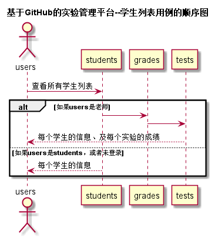

# 学生表-用例 [返回](../README.md)

## 1.用例说明

| 用例名称   | 学生列表                           |
| :--------- | :--------------------------------- |
| 功能       | 以表形式的显示出所有学生的信息     |
| 参与者     | 游客，学生，老师                   |
| 前置条件   | 学生和老师需要先登录，并且登陆成功 |
| 后置条件   | 显示学生表                         |
| 主事件流   |                                    |
| 备选事件流 |                                    |

## 2.业务流程

## 3.界面设计

- 界面
- API接口调用：

	 [ ] 	 接口1:[getStudents](../接口/getStudents.md)

## 4.算法描述

无

## 5.参照表

- [学生表](../数据库设计.md)
- [学期表](../数据库设计.md)
- [实验表](../数据库设计.md)
- [分值表](../数据库设计.md)

