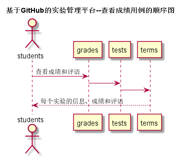
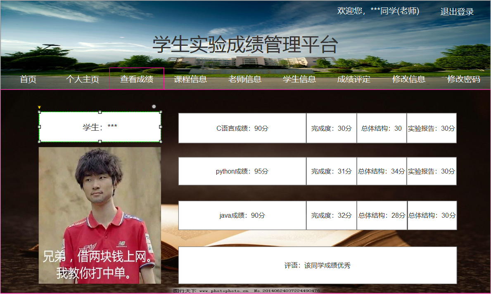

## 查看成绩-用例 [返回](../README.md)

### 1. 用例规约

用例名称 | 学生列表
---|---
功能 | 学生查看自己的每个实验的实验成绩及实验评价 
参与者 | 学生
前置条件 | 学生需要先登录，并且登录成功 
后置条件 | 显示成绩数据 
主事件流 | 
备选事件流 | 

### 2. 业务流程（顺序图）

### 3. 界面设计

- API接口调用
    - 接口1：[getGrades](../接口/getGrades.md)

### 4. 算法描述

无

### 5. 参照表
- [学生表](../数据库设计.md)
- [学期表](../数据库设计.md)
- [实验表](../数据库设计.md)
- [分值表](../数据库设计.md)
