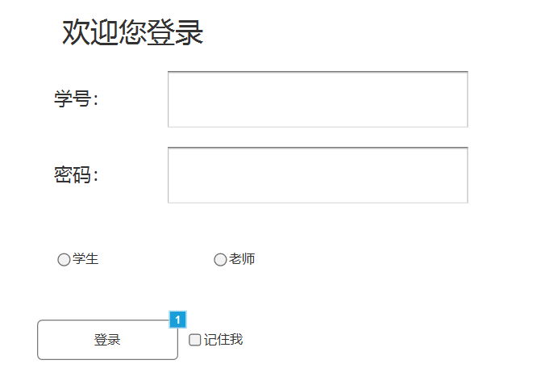
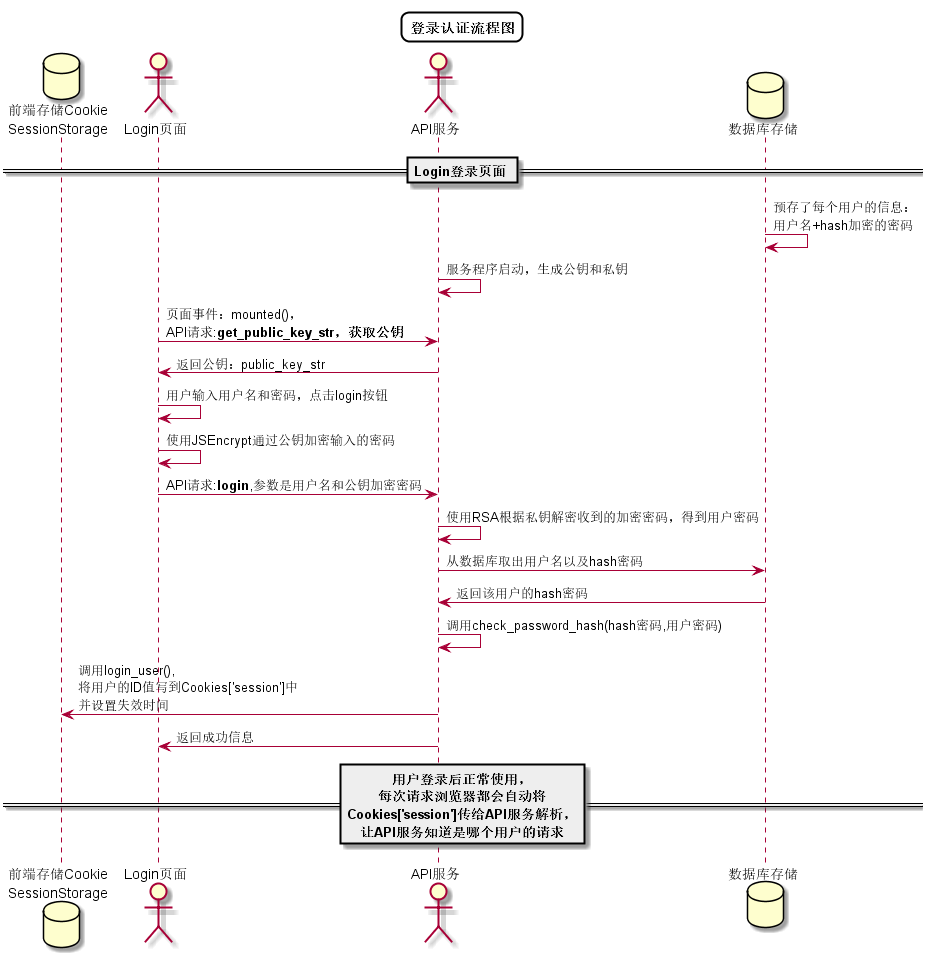

## 登录-用例

### 1. 用例规约

用例名称 | 登录
---|---
功能 | 用户登录平台 
参与者 | 访客，学生，老师 
前置条件 | 需要正确的账号和密码 
后置条件 | 登出后，跳转到相应的角色页面 
主事件流 | 1. 访客输入用户名和密码，选择用户类型  2.系统判断用户名，密码，用户类正确，允许登录 3.系统在客户端以Cookie形式存储登录用户信息，保持登录的持久性。
备选事件流 | 1输入的用户名或者密码为空  1a.提示重新输入  2.访客重新提交登录信息  2a.系统判断用户名，密码，用户类不正确，不允许登录  3.提示重新输入  3a.访客重新提交登录信息 

### 2. 业务流程（顺序图）
无

### 3. 界面设计

界面参照：[https://luojiajie.github.io/is_analysis/test6/ui/主界面设计/登录.html](https://luojiajie.github.io/is_analysis/test6/ui/主界面设计/登录.html)

- API接口调用
    - 接口1：[login](../接口/login.md)

### 4. 算法描述

### 5. 参照表
- [学生表](../数据库设计.md)
- [老师表](../数据库设计.md)
