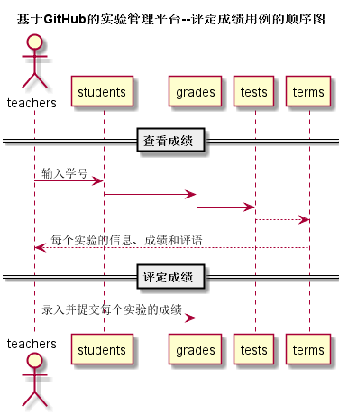
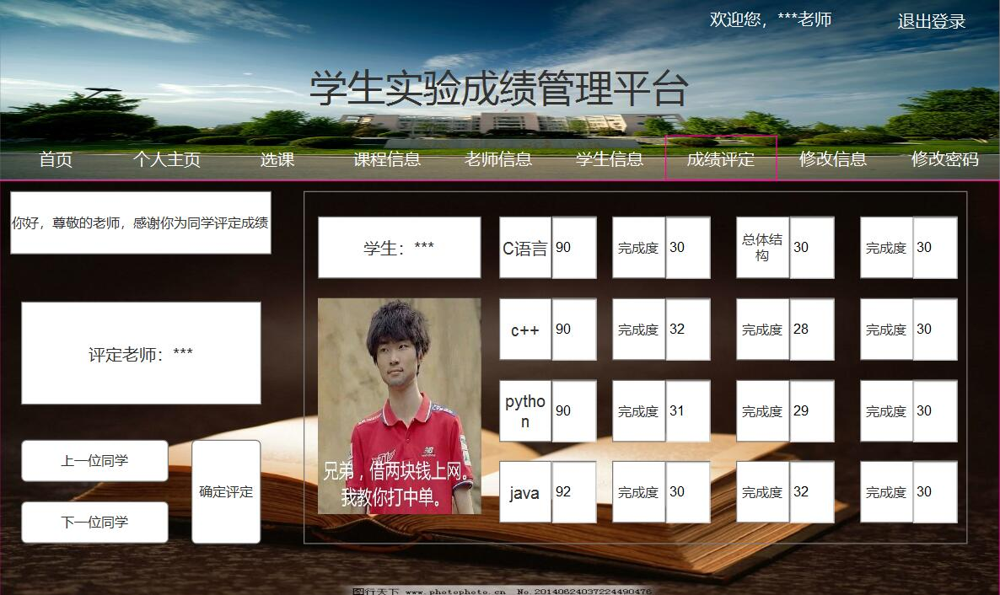

## 评定成绩-用例 [返回](../README.md)

### 1. 用例规约

用例名称 | 评定成绩
---|---
功能 | 老师评定一个学生的实验成绩
参与者 | 老师
前置条件 | 查看成绩：评定成绩之前，老师需要先登录并成功登录，并显示出一个学生的所有实验成绩和评语信息 
后置条件 | 评定成绩提交之后，系统自动设置成绩更新日期为当前日期，自动计算平均成绩
主事件流 | 1. 查看已有的成绩  2. 输入一个或者多个实验的成绩和评语  3. 提交  4.系统存储实验成绩和评语 5. 系统自动计算平均成绩 
备选事件流 | 1.成绩必须是0至100之间，可以为空，但不能超界  2.提示用户重新输入成绩分数 3.输入成绩正确 

### 2. 业务流程（顺序图）

### 3. 界面设计

界面参照：[https://luojiajie.github.io/is_analysis/test6/ui/主界面设计/评定成绩.html](https://luojiajie.github.io/is_analysis/test6/ui/主界面设计/评定成绩.html)

- API接口调用
    - 接口1：[getNextPrevStudent](../接口/getNextPrevStudent.md)   用于取得上一个或者下一个学生的学号
    - 接口2：[getOneStudentResults](../接口/getOneStudentResults.md)   用于显示一个学生的所有实验成绩和评语
    - 接口3：[setOneStudentResults](../接口/setOneStudentResults.md)   用于设置一个学生的部分实验成绩和评语

### 4. 算法描述

无

### 5. 参照表
- [学生表](../数据库设计.md)
- [学期表](../数据库设计.md)
- [实验表](../数据库设计.md)
- [分值表](../数据库设计.md)
