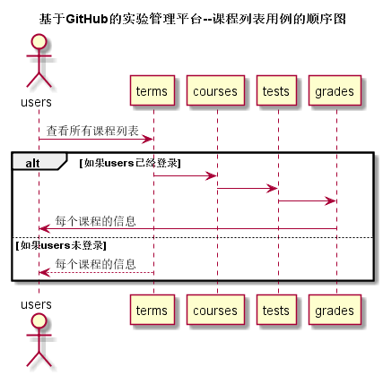
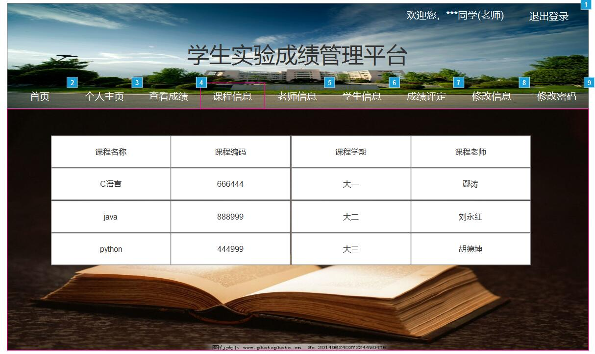

## 课程/实验/评分表-用例 [返回](../README.md)

### 1. 用例规约

用例名称 | 课程/实验/评分列表
---|---
功能 | 以表形式的显示出所有课程的信息
参与者 | 学生和老师 
前置条件 | 学生和老师都需要先登录 
后置条件 | 显示课程相关列表 
主事件流 | 
备选事件流 | 

### 2. 业务流程（顺序图）

### 3. 界面设计

界面参照：[https://luojiajie.github.io/is_analysis/test6/ui/主界面设计/课程表.html](https://luojiajie.github.io/is_analysis/test6/ui/主界面设计/课程表.html)

- API接口调用
    - 接口1：[getCourses](../接口/getCourses.md)

### 4. 算法描述
无
### 5. 参照表
- [老师表](../数据库设计.md)
- [课程表](../数据库设计.md)
- [学期表](../数据库设计.md)
- [学生表](../数据库设计.md)
- [分值表](../数据库设计.md)
- [实验表](../数据库设计.md)
